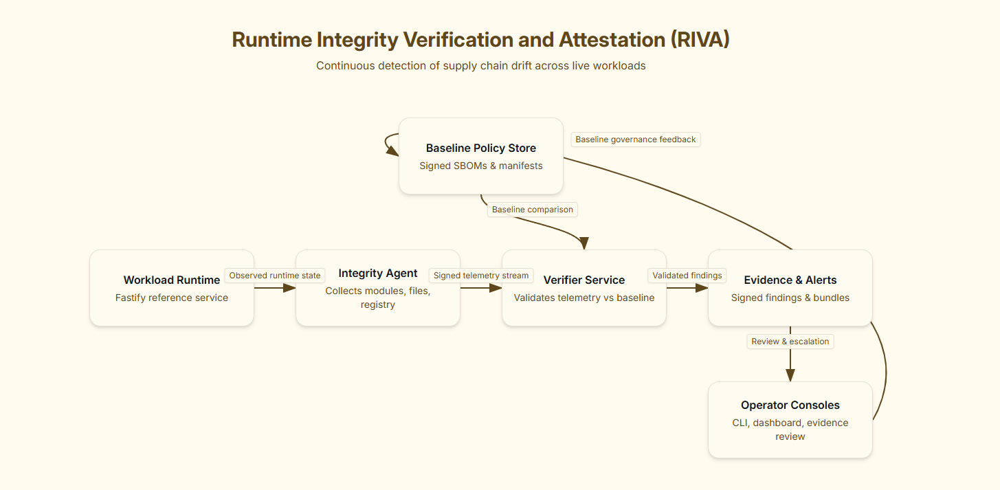
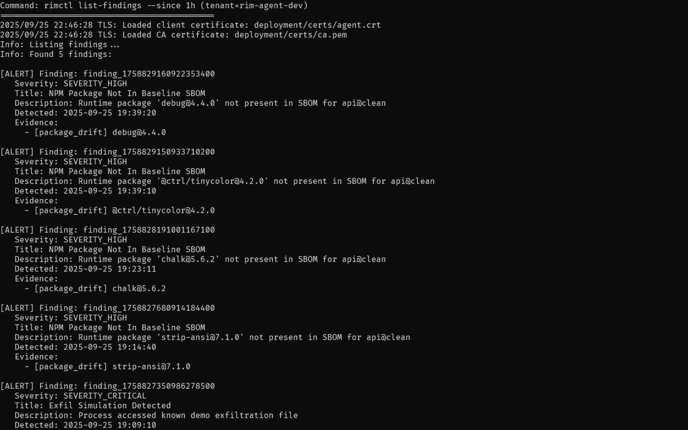
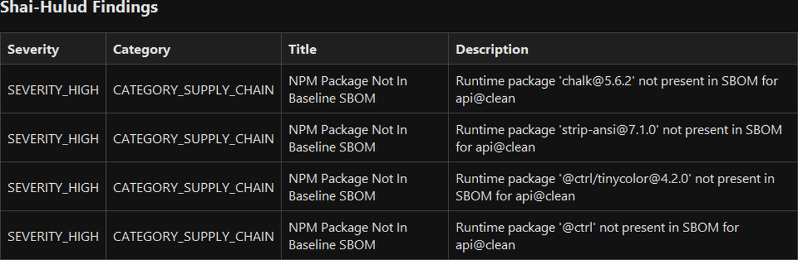

## Executive Summary
RIVA provides cryptographically signed runtime evidence that closes the gap left by SBOMs and build attestations. In September 2025 lab runs it detected four unauthorized npm packages and a scripted exfiltration, producing signed JSON evidence. This remains a personal research prototype; access to the implementation is offered through guided demos for interested security teams and researchers.

## 1. Background & Related Work
Supply chain programs have matured around pre-deployment controls: SLSA-style provenance, Sigstore signatures, and Chainguard baselines all verify what leaves the build system. Once code is running, defenders often fall back to behavioral monitors such as Falco or KSOC RAD, tuning syscall rules in the hope they will surface drift. Admission controls like Google's Binary Authorization and Teleport's Sigstore attestation keep untrusted workloads from starting, yet auditors still ask the live question: what is executing right now? RIVA explores signed runtime evidence to answer that final step.

- Pre-deployment controls (SLSA, Sigstore, Chainguard) secure the build pipeline but do not observe runtime execution.
- Runtime detectors (Falco, KSOC RAD) depend on heuristic rules; RIVA introduces baseline-aware findings backed by signatures.
- Admission controls (Binary Authorization, Teleport Sigstore attestation) govern deployment, while RIVA extends trust into continuous execution.
## 2. Motivation
In 2024 the XZ Utils backdoor showed how trusted software can be subverted after release. In 2025 the npm "Shai-Hulud" replicas reinforced the lesson: SBOMs and signed builds told defenders what was approved, yet runtime drift still sneaked into production. Dependency swaps behaved normally and passed health checks, leaving teams blind to what was actually running. During incident reviews we saw how runtime truth was missing; security teams could quote their SBOM, but they could not prove that production matched it.

RIVA was built to answer that question. By pairing a host agent with a verifier service, we can gather signed runtime evidence and compare it to the approved baseline, revealing silent drift that existing tools missed.

- Signed SBOMs and attestations do not show what executes after deployment.
- Runtime drift can remain invisible when services stay healthy or mimic legitimate behavior.
- RIVA complements pre-deployment controls with cryptographically signed runtime evidence and drift findings.

## 3. Architecture Overview



**Component roles**
- Workload Runtime - Fastify reference API executing the demo scenarios.
- Integrity Agent - Windows service observing processes, Node.js module loads, file writes, and registry keys via ETW/Toolhelp/FS watchers; signs each Signed Attestation Record (SAR) with Ed25519.
- Verifier Service - Go service with REST/gRPC endpoints, PostgreSQL storage, and a rule engine evaluating SARs against SBOM/baseline policy.
- Baseline Policy Store - Signed manifests and SBOM imports managed through the `rimctl` control CLI.
- Evidence & Alerts - Findings store and exporters for JSON/SIEM integrations.
- Operator Consoles - `rimctl` control CLI and optional web UI for baseline import, findings review, and evidence export.

**Telemetry flow**
1. Agent captures runtime state (module hashes, file/registry touches, behavior metrics) and signs a SAR.
2. Verifier authenticates the client certificate, validates the signature/nonce, and persists telemetry.
3. Rule engine evaluates package drift, registry persistence, binary hash mismatch, exfil simulation, and behavior drift stubs.
4. Findings are re-signed, stored, and exposed through CLI, UI, or SIEM exporters.

## 4. Demonstrated Evidence (25-26 Sept 2025)

### 4.1 Supply Chain Compromise Simulation


*Command:* `rimctl list-findings --since 1h`

```jsonc
{
  "finding_id": "finding_1758827680914184400",
  "severity": "SEVERITY_HIGH",
  "title": "NPM Package Not In Baseline SBOM",
  "evidence": [
    { "type": "package_drift", "actual": "strip-ansi@7.1.0" }
  ]
}
```
- Four unauthorized packages (`debug@4.4.0`, `@ctrl/tinycolor@4.2.0`, `chalk@5.6.2`, `strip-ansi@7.1.0`) detected while the service stayed healthy.
- The additions were benign stand-ins absent from the approved SBOM, illustrating how RIVA flags silent drift even when the service continues operating normally.
- Exfil script touched `C:\\Users\\ali\\AppData\\Local\\Temp\\rim-demo-exfil.txt`, triggering a Critical finding tied to `node.exe`.

### 4.2 Shai-Hulud Baseline Recreation


*Command:* `rimctl list-findings --since 1h`
- Shows pure SBOM drift detections using sanitized package replicas.
- Full exports available as signed JSON bundles captured during the run.

## 5. Current Capabilities
- Signed SARs with per-record nonces and Ed25519 signatures.
- mTLS enforced between agent and verifier using the lab certificate bundle.
- Rule coverage for Windows workloads (package drift, registry persistence, exfil simulation, behavior drift stubs).
- CLI workflows for SBOM import, baseline management, and findings export via the `rimctl` control CLI.
- Demo harnesses automating the two scenarios above.

## 6. Limitations (Sept 2025)
1. **Baseline Trust** - Imports require manual approval; compromised baselines remain a risk. Dual-signature workflows, reproducible build checks, and tamper-evident logs are planned.
2. **Platform Coverage** - Windows agent is hardened; Linux/Kubernetes collectors exist but are experimental and lack evidence.
3. **Network Drift** - Rule definitions exist but end-to-end telemetry/UI surfacing remain TODO.
4. **Behavior Rules** - Limited to demo persistence/exfil behaviors; broader anomaly coverage not yet shipped.
5. **No Enforcement** - RIVA detects and reports; it does not quarantine workloads or automate rollback.
6. **Sanitized Payloads** - Findings use safe reconstructions, proving telemetry flow but not covering every real-world adversary technique.

## 7. Roadmap
- Automate baseline governance (dual approval, signed provenance, periodic revalidation).
- Harden Linux/Kubernetes agents with eBPF collectors and document deployment guides.
- Deliver network drift findings end to end (covering agent capture, verifier rules, and CLI/UI evidence) and validate the pipeline with regression tests before pilot use.
- Extend behavior drift rules; evaluate optional anomaly models as supplemental signals.
- Add `rimctl` export bundle command packaging findings, transcripts, and screenshots.

## 8. Conclusion
RIVA demonstrates that signed runtime attestation is feasible on Windows today, delivering actionable evidence of supply chain drift and simulated exfiltration. With the planned expansion to Linux and Kubernetes, plus automated baseline governance, the project aligns with emerging regulatory expectations such as EU NIS2 and DORA that call for continuous integrity assurance.

## Engagement
Security teams and researchers interested in runtime integrity pilots can reach me at ali.muhammad.ali@outlook.com or https://www.linkedin.com/in/muhammadali555/. 
Guided demos and source review are available on request.

## References
1. OpenSSF. "Supply-chain Levels for Software Artifacts (SLSA) v1.0." 2023. https://slsa.dev/spec/v1
2. Sigstore Project. "Sigstore: Signing software the easy way." Accessed Sept 2025. https://www.sigstore.dev
3. Falco Project. "Falco Rules and Engine." CNCF, 2025. https://falco.org/docs
4. KSOC. "Runtime Application Drift (RAD) standard." Accessed Sept 2025. https://ksoc.com/blog/runtime-application-drift-standard
5. Google Cloud. "Binary Authorization documentation." Accessed Sept 2025. https://cloud.google.com/binary-authorization
6. Teleport. "Sigstore workload attestation." Accessed Sept 2025. https://goteleport.com/docs/deployments/reference/sigstore-attestation/
7. European Union. "Directive (EU) 2022/2555 on measures for a high common level of cybersecurity (NIS2)." Official Journal of the European Union, Dec 2022.
8. European Union. "Regulation (EU) 2022/2554 on digital operational resilience for the financial sector (DORA)." Official Journal of the European Union, Dec 2022.
