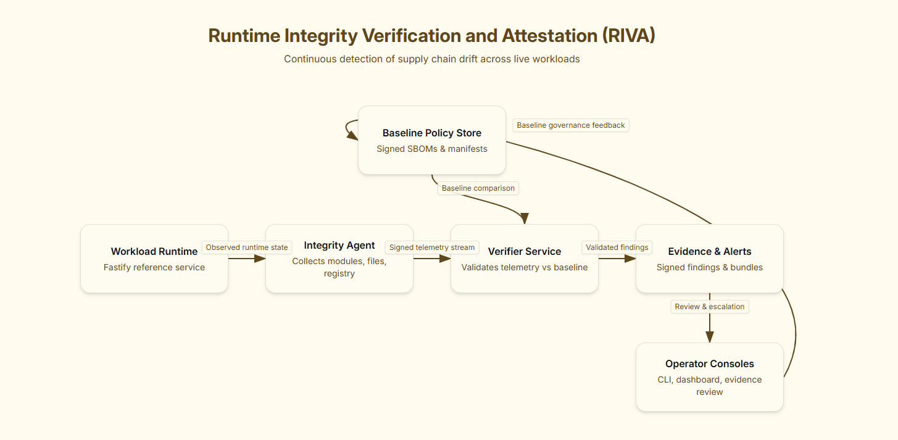
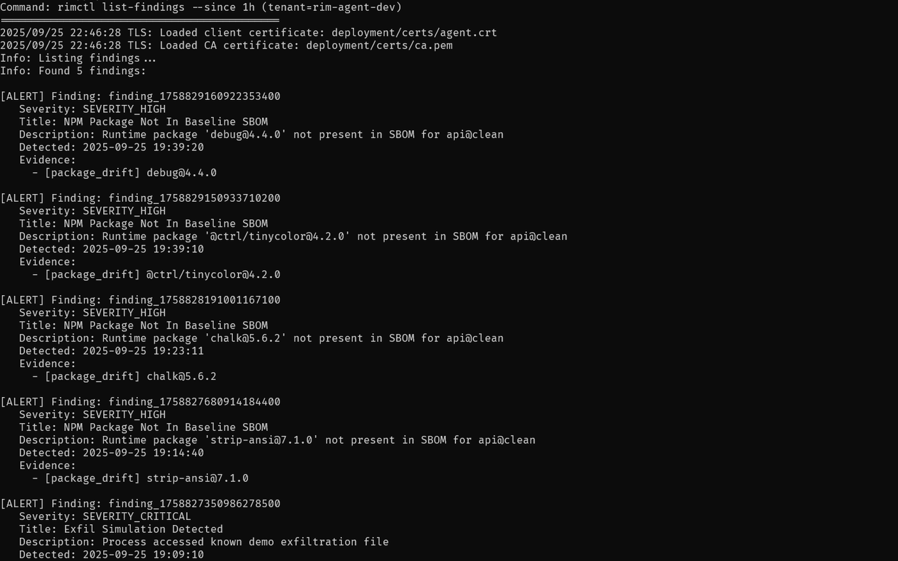
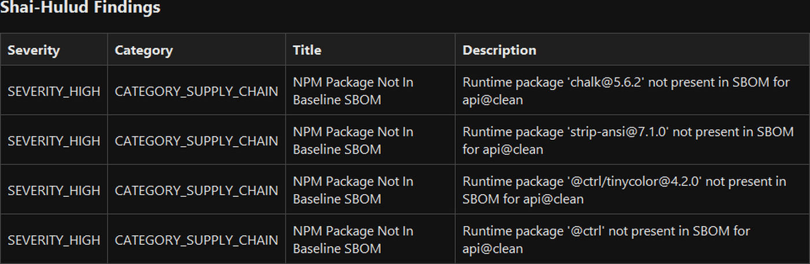

# RIVA: Signed Runtime Evidence for Supply-Chain Drift

Muhammad Ali
First written September 2025.

---

## Summary

I built RIVA because SBOMs and build signatures don't answer "what's actually running right now?" It's a Windows agent plus a Go verifier that produces signed runtime evidence and compares it against a known baseline. In a lab run on 25–26 September 2025, it caught four unauthorised npm packages and a scripted exfiltration while the service's health checks stayed green.

This is a personal prototype. The agent is Windows-only, the payloads are sanitised, and baseline trust still leans on manual approval.

## 1. Background

The supply-chain attestation story is well-developed for build time. SLSA gives provenance, Sigstore gives signatures, Chainguard ships pre-hardened images. Admission controls like Binary Authorization or Teleport's Sigstore workload attestation stop unknown workloads from even starting.

After the workload is running, the story thins out. Falco looks at syscalls. KSOC RAD tracks behavioural drift. Both are powerful. Both are heuristic. They'll tell you something looks off. They don't give you a signed artefact proving the running process is the one you approved.

RIVA lives in that gap.

## 2. Why I built it

The XZ Utils backdoor in 2024 and the npm "Shai-Hulud" worm in 2025 landed the same point from opposite directions. XZ made it into trusted distribution channels with a legitimate maintainer's signature and was caught by one engineer investigating a 500 ms sshd login delay. Shai-Hulud actually hit production projects through packages that had passed every normal check. In both cases the dependencies were approved, the signatures verified, the SBOMs matched the image, and nothing in the existing runtime story answered the question that actually mattered: *is what's executing the same thing we shipped?*

I wanted to see how hard it would be to answer that cryptographically rather than heuristically. Hence RIVA: one host agent, one verifier, Ed25519-signed records, a diff against a baseline.

## 3. Architecture



**Components**
- *Workload Runtime*: a Fastify reference API used for the demo scenarios.
- *Integrity Agent*: Windows service watching processes, Node.js module loads, file writes, and registry keys through ETW, Toolhelp, and filesystem watchers. Signs each Signed Attestation Record (SAR) with Ed25519.
- *Verifier Service*: Go service, REST and gRPC, PostgreSQL for storage, a rule engine that scores SARs against SBOM and baseline policy.
- *Baseline Policy Store*: signed manifests and imported SBOMs, managed through `rimctl` (the control CLI).
- *Evidence & Alerts*: findings store with JSON and SIEM exporters.
- *Operator Consoles*: `rimctl` plus an optional web UI for baseline import and findings review.

**Flow**
1. Agent captures runtime state (module hashes, file and registry touches, behaviour metrics), signs a SAR.
2. Verifier authenticates the client certificate, validates signature and nonce, persists the telemetry.
3. Rule engine evaluates package drift, registry persistence, binary-hash mismatch, exfil simulation, behaviour-drift stubs.
4. Findings are re-signed, stored, exposed through CLI, UI, or SIEM.

## 4. Demonstrated evidence (25–26 Sept 2025)

### 4.1 Supply-chain compromise simulation



*Command:* `rimctl list-findings --since 1h`

```jsonc
{
  "finding_id": "finding_1758827680914184400",
  "severity": "SEVERITY_HIGH",
  "title": "NPM Package Not In Baseline SBOM",
  "evidence": [
    { "type": "package_drift", "actual": "strip-ansi@7.1.0" }
  ]
}
```

Four packages not in the approved SBOM (`debug@4.4.0`, `@ctrl/tinycolor@4.2.0`, `chalk@5.6.2`, `strip-ansi@7.1.0`) were detected while the service kept replying 200. The additions were benign stand-ins. The point was to show the tool flags drift even when the workload stays healthy. The exfil script touched `C:\Users\ali\AppData\Local\Temp\rim-demo-exfil.txt`, which triggered a Critical finding tied to `node.exe`.

### 4.2 Shai-Hulud baseline recreation



*Command:* `rimctl list-findings --since 1h`

Pure SBOM drift detection using sanitised package replicas. Signed JSON bundles are in the run artefacts.

## 5. What works today

- SARs signed per-record with Ed25519, each with its own nonce.
- mTLS between agent and verifier using the lab certificate bundle.
- Rules for Windows workloads: package drift, registry persistence, exfil simulation, behaviour-drift stubs.
- `rimctl` workflows for SBOM import, baseline management, findings export.
- Two demo harnesses for the scenarios above.

## 6. What doesn't work yet

1. **Baseline trust.** Imports are manually approved. A compromised baseline is still a compromised baseline. Dual-signature workflows and reproducible-build checks are on the list.
2. **Platform coverage.** The Windows agent is the solid one. Linux and Kubernetes collectors exist but are experimental and I haven't demo'd them.
3. **Network drift.** Rules are defined. The end-to-end telemetry path to CLI and UI isn't finished.
4. **Behaviour rules.** Only cover the demo persistence and exfil cases. Anomaly coverage is shallow.
5. **No enforcement.** RIVA reports. It does not quarantine or roll back.
6. **Sanitised payloads.** The proofs show the pipeline works. They don't cover every real adversary technique.

## 7. Roadmap

- Baseline governance: dual approval, signed provenance, periodic revalidation.
- Linux and Kubernetes agents with eBPF collectors and a deployment guide.
- Network-drift findings end-to-end: agent capture, verifier rules, CLI and UI evidence, regression tests before I'd show it to anyone.
- Broader behaviour-drift rules. Optional anomaly models as a supplement, not a substitute.
- `rimctl export-bundle` for packaging findings, transcripts, and screenshots into a single artefact.

## 8. Current state

That's where the prototype is today. Section 4 is reproducible on the lab VM. Section 7 is what I work on next. If any of it is useful to you, contact details are below.

## Contact

ali.muhammad.ali@outlook.com · [LinkedIn](https://www.linkedin.com/in/muhammadali555/)

Guided demos and source walkthroughs on request.

## References

1. OpenSSF. "Supply-chain Levels for Software Artifacts (SLSA) v1.2." https://slsa.dev/spec/v1.2/
2. Sigstore Project. "Sigstore." https://www.sigstore.dev
3. Falco Project. "Falco Documentation." CNCF. https://falco.org/docs
4. Google Cloud. "Binary Authorization documentation." https://docs.cloud.google.com/binary-authorization/docs
